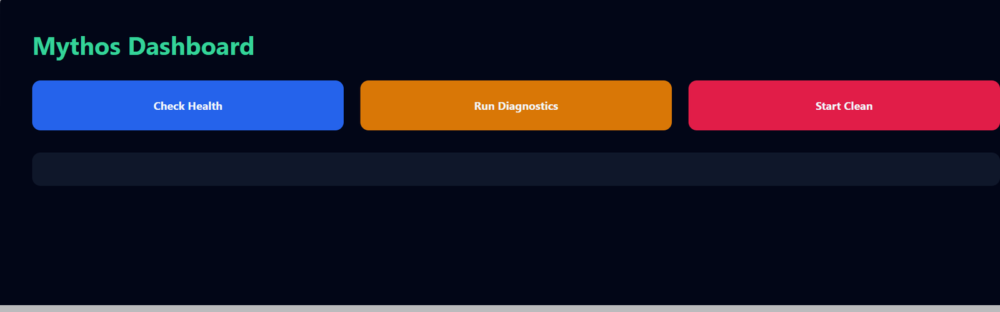
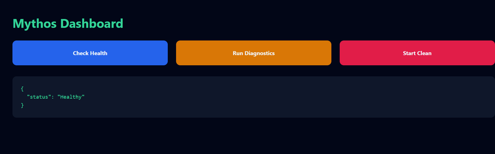
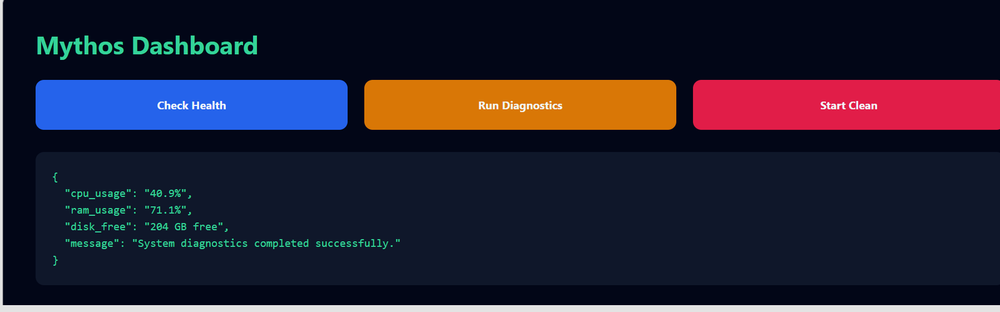

# Mythos Agent

<p align="center">
  <strong>One-click local system health checks, live diagnostics, and temporary-file cleanup.</strong>
</p>

<p align="center">
  
  
  
  
  
</p>

## What is Mythos?

**Mythos Agent** is a lightweight local system controller that turns common maintenance tasks into a simple browser dashboard. It lets a user:

- confirm that the monitoring service is healthy;
- inspect current CPU, RAM, and disk availability;
- clean removable files from the current user's temporary directory;
- test the same actions through FastAPI's interactive API documentation.

The working dashboard is served directly by the FastAPI backend. A Next.js frontend scaffold is included for future expansion.

> **OpenAI Build Week:** Codex and GPT-5.6 were used throughout planning, implementation, debugging, environment setup, testing, and submission preparation. The current local runtime does not require an OpenAI API key.

## Working Demo

<p align="center">
  
</p>

### 1. Health Check

Confirms that the local monitoring service is available and responding.

<p align="center">
  
</p>

### 2. Live System Diagnostics

Reads current CPU usage, RAM usage, and free disk space from the local machine.

<p align="center">
  
</p>

### 3. Temporary-File Cleanup

Attempts to remove deletable files from the current user's temporary directory and reports how many were removed.

<p align="center">
  
</p>

## Core Features

| Feature | Purpose | Endpoint |
|---|---|---|
| Health Check | Confirms that the service is operational | `GET /health` |
| System Diagnostics | Reports CPU, RAM, and available disk space | `POST /diagnose` |
| Temporary Cleanup | Removes deletable files from the user's temp directory | `POST /clean` |
| Web Dashboard | Provides one interface for all three actions | `GET /` |
| Interactive API Docs | Provides Swagger UI for testing | `GET /docs` |

## Tech Stack

- **Backend:** Python, FastAPI, Uvicorn
- **System metrics:** `psutil`
- **Dashboard:** HTML, CSS, and JavaScript served by FastAPI
- **Frontend scaffold:** Next.js, React, TypeScript, Tailwind CSS
- **AI-assisted workflow:** Codex with GPT-5.6

## Project Structure

```text
mythos-agent/
├── core/                         # Core controller modules
├── docs/
│   └── screenshots/              # Working demo screenshots
├── mythos-frontend/              # Next.js frontend scaffold
├── config.py                     # Project configuration
├── main.py                       # FastAPI app, endpoints, and dashboard
├── requirements.txt              # Python dependencies
└── README.md
```

## Run Locally

### Prerequisites

- Windows 10 or 11
- Python 3.10 or newer
- Git
- Node.js 20 or newer, only for the optional Next.js scaffold

### 1. Clone the repository

```powershell
git clone https://github.com/fokrulanthro16-eng/mythos-agent.git
cd mythos-agent
```

### 2. Create and activate a virtual environment

```powershell
py -m venv .venv
Set-ExecutionPolicy -Scope Process -ExecutionPolicy Bypass
.\.venv\Scripts\Activate.ps1
```

### 3. Install backend dependencies

```powershell
python -m pip install --upgrade pip
pip install -r requirements.txt
```

### 4. Start the backend

```powershell
python -m uvicorn main:app --reload --host 127.0.0.1 --port 8000
```

Open:

- Dashboard: `http://127.0.0.1:8000`
- API docs: `http://127.0.0.1:8000/docs`

### Optional: run the Next.js scaffold

Open a second terminal:

```powershell
cd mythos-frontend
npm install
npm run dev
```

Then open `http://localhost:3000`.

## Example API Responses

### `GET /health`

```json
{
  "status": "Healthy"
}
```

### `POST /diagnose`

```json
{
  "cpu_usage": "40.9%",
  "ram_usage": "71.1%",
  "disk_free": "204 GB free",
  "message": "System diagnostics completed successfully."
}
```

Diagnostic values change depending on the machine and the time of the request.

### `POST /clean`

```json
{
  "message": "Successfully deleted 194 temporary files."
}
```

The number varies. Locked or inaccessible files are skipped.

## How Codex and GPT-5.6 Accelerated Development

Codex and GPT-5.6 helped to:

- turn the initial concept into a runnable FastAPI application;
- organize backend and frontend project structure;
- implement and review system-health endpoints;
- troubleshoot Python environment and package-installation issues;
- validate the complete local demo flow;
- prepare documentation, screenshots, and submission materials.

The developer selected the product direction, ran the project locally, verified the behavior, and made the final implementation and submission decisions.

## Safety and Current Limitations

- This is a **hackathon prototype**, not a production optimization suite.
- The cleanup action changes local files; review `main.py` before using it on an important machine.
- Locked or inaccessible temporary files are skipped.
- Disk reporting currently assumes a Windows `C:` drive.
- Authentication, audit logs, restore/undo, scheduling, and granular cleanup selection are not yet included.

## Roadmap

- Preview and confirmation before cleanup
- Detailed cleanup logs and recovery strategy
- CPU, memory, and disk threshold alerts
- Connect the Next.js interface to the FastAPI API
- Cross-platform disk detection
- Automated tests and CI
- Optional AI-generated diagnostic explanations

## Submission

- **Repository:** https://github.com/fokrulanthro16-eng/mythos-agent
- **Demo video:** Add the public or unlisted YouTube URL here
- **Codex session:** Add the `/feedback` session ID to the Devpost submission form

## License

Add the open-source license that matches your intended reuse terms before final judging.
